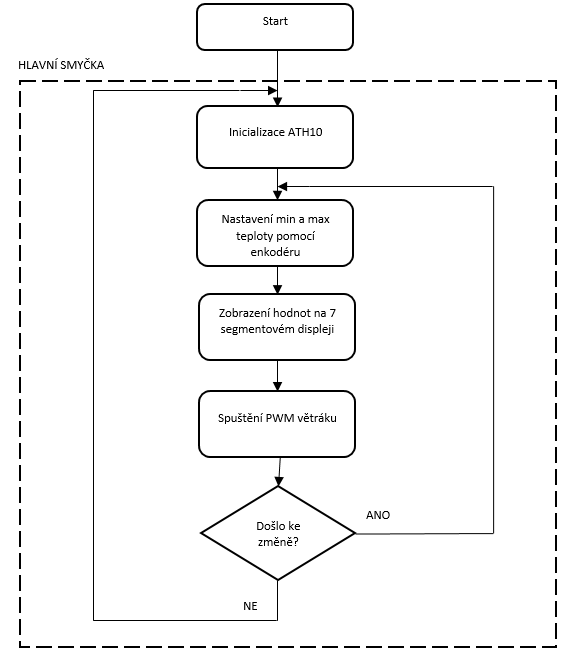
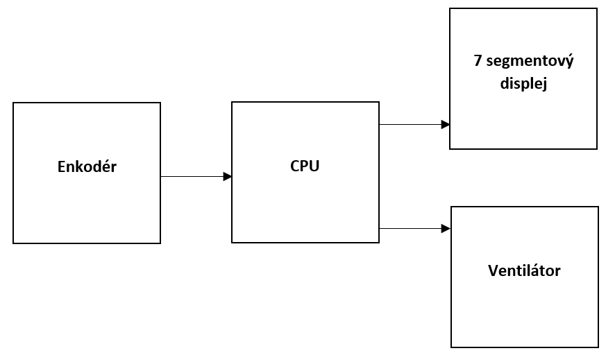
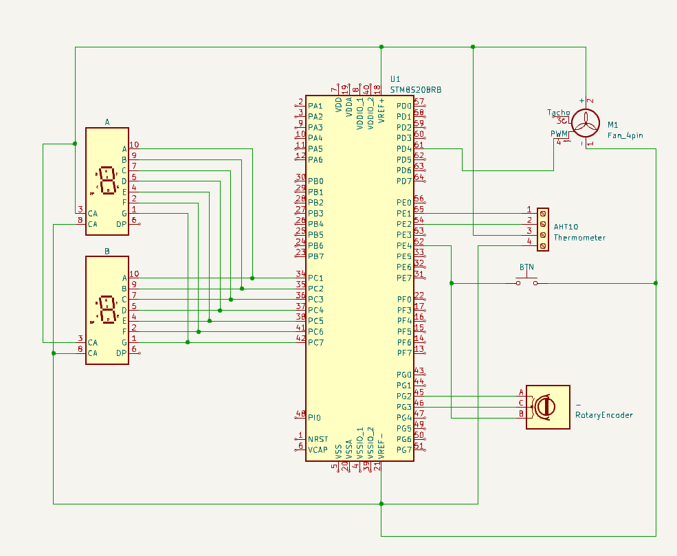

# Termoregulátor
## Zadání
1. Otáčky ventilátoru řízené teplotou
2. Digitální nastavení teploty pro 0% otáček a 100% otáček

## Popis

Tento projekt implementuje teplotní regulační systém pomocí mikrokontroléru STM8S. Čte teplotu ze senzoru ATH10 přes I2C, zobrazuje aktuální teplotu a umožňuje uživateli nastavit minimální a maximální teplotní prahy pomocí tlačítka a enkodéru. Systém upravuje PWM výstup ventilátoru na základě naměřených teplot.

## Hardwarové požadavky

- STM8S mikrokontrolér
- ATH10 I2C teplotní senzor
- 7-segmentový displej
- Tlačítko
- Rotační enkodér
- Ventilátor (řízený pomocí PWM)

## Softwarové požadavky

- STM8S Standard Peripheral Library
- SWI2C knihovna pro I2C komunikaci
- Já osobně použil prostředí PlatformIO ve VS Code

## Použití

1. Inicializujte systém voláním funkce `setup()`.
2. Inicializujte senzor ATH10 pomocí `init_ath10()`.
3. Nastavtujte PWM pomocí `setup_pwm()`.
4. V hlavní smyčce zpracovávejte stisknutí tlačítka a akce enkodéru pro úpravu teplotních prahů.
5. Pravidelně čtěte teplotu ze senzoru ATH10 a upravujte PWM výstup na základě teploty.

## Vývojový diagram

## Blokové schéma

## Schéma zapojení

## Závěr
Splnil jsem úspěšně body zadání a odnesl jsem si z projektu cenné zkušenosti, které v praxi určitě využiju.
Projekt mi trval přibližně 5 hodin mého drahocenného času, kterého ani vteřinu nelituji.
Myslím že tato manifestace PWM větráku řízené teplotou se mi velmi povedla.

